# LaMa: Resolution-robust Large Mask Inpainting with Fourier Convolutions
## Overview

[Project page](https://saic-mdal.github.io/lama-project/) |
[arXiv](https://arxiv.org/abs/2109.07161) |
[Supplementary](https://ashukha.com/projects/lama_21/lama_supmat_2021.pdf) |
[BibTeX](https://senya-ashukha.github.io/projects/lama_21/paper.txt) |
[Casual GAN Papers Summary](https://www.casualganpapers.com/large-masks-fourier-convolutions-inpainting/LaMa-explained.html) | 
[Demo on Colab](https://colab.research.google.com/drive/1jBeleCnQfh1ZgnaYyhWs6hQU72ZoQ0K4?usp=sharing)

LaMa 是個圖像修復模型，透過欲修復區塊附近的背景或物體顏色進行填補，

## 模型/硬體限制
### 解析度
- 論文中有測試 640 × 512 和 1280 × 1536 的圖片且效果皆不錯，這裡評估使用 1280 * 1280 的圖片模型也能夠使用。
- 2048 × 1080 （2K）的圖片也支援

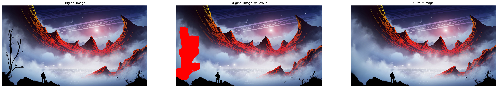

- 3840 x 2160 （4K）的圖片目前還沒成功（測試用的 Colab 會 crash）

### 時長
Inference Time 使用 1280 × 1280 （HD）的圖片做測試，塗改面積平均佔圖片 7 - 10%，最大佔 20%；runtime 計算為五次平均

| 張數  |平均 GPU Runtime（s） | 平均 CPU Runtime（s） | GPU 記憶體（峰值）（MB） |
|-----|----------------------|---------------------|------------------------|
| 5   | 7.867                | 115.945             | 4142                   |
| 10  | 11.193               | 229.517             | 4142                   |
| 20  | 19.811               | 457.541             | 4142                   |

### 測試時硬體規格
- OS：Ubuntu 20.04
- GPU：NVIDIA Tesla V100 SXM2 single core
- GPU Memory：30 GB
- Memory：60 GB
- CUDA Driver：460.119.04
- CUDA：11.4
- cuDNN：8.x.x
- Python version：3.8.10
- CPU：Intel(R) Xeon(R) Gold 6154 CPU @ 3.00GHz
- Num. of CPU：36

## 整體 Pros
1. 適用場合：小面積塗改、塗改物件周圍顏色較一致且無任何文字
2. 因為依靠物體周圍背景的顏色和圖案去做填補，所以顏色本身的色相、飽和度、亮度（Hue、Saturation、Brightness）等對每個像素所填顏色的影響不大（簡單說就是模型不會說比較會填某些特顏色或對背景哪些顏色較敏感），但肉眼觀察的話會因為人眼敏感度「看起來」結果較佳或較差
3. 如果塗改的物件周圍的背景較有規律，如單色、顏色漸層、平行線、網格，模型能夠進行合適填補
4. 即使塗改的物件兩側留給模型參考的背景顏色不同，模型在填補時能夠透過漸層去銜接

## 整體 Cons
1. 塗抹欲修改的物件時，周圍須覆蓋一定的範圍（即不能只塗到物件的邊緣，要覆蓋到一些背景，見 Case 2-2）
2. 塗改時因為周圍背景的複雜度不同，塗改邊界需要的細膩度也會不同，最好要有能調整大小的畫筆
3. 塗改的區域如果是空心的，模型也會參考空心的顏色進行填補，如果空心部分的顏色剛好和外部周圍的顏色有些差異，填補效果可能有點突兀（e.g. 深色區域中有一突兀亮點，見 Case 2-2）

## Test Cases
### Case 1-1


1. 筆畫沒有完全蓋住兩人的影子，所以產生的圖片不只保留還延伸了人影
2. 後方灰色外套的路人因為沒有完全蓋住，所以同樣被延伸取代擦掉的區塊，甚至稍微還原些人形
3. 地面上的燈光還原後稍微有些扭曲，但如果看圖片整體不亦察覺

<center>
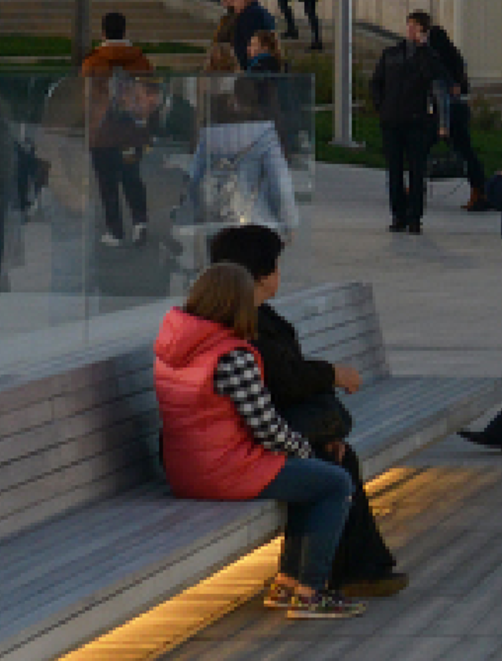 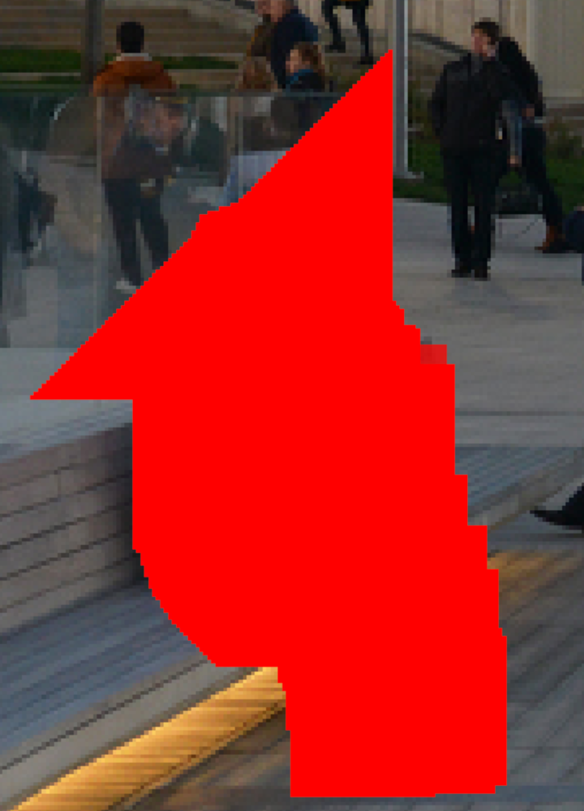 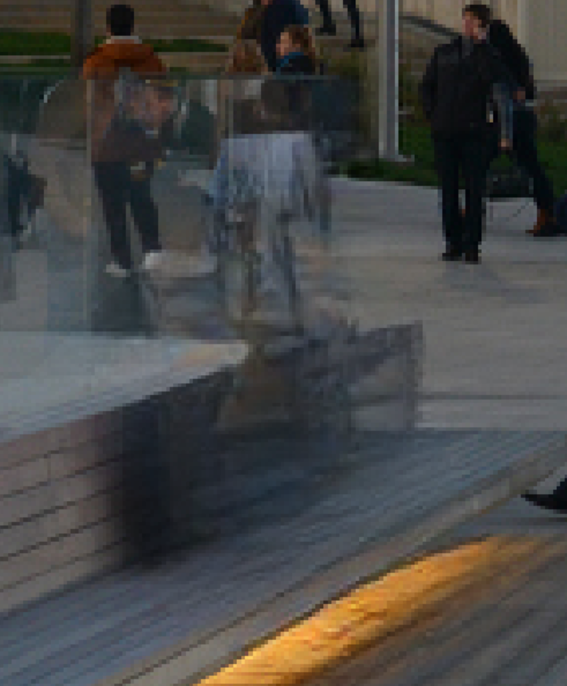
</center>


### Case 1-2


1. 兩人的人影完全被筆畫覆蓋，所以產生的圖片完全不存在影子
2. 後方灰色外套原本下半身是被黑衣男子蓋住的，但是模型能夠將其背包和外套下半部分延伸
3. 座椅稍微扭曲，但不亦察覺；腳下燈光算完整

<center>
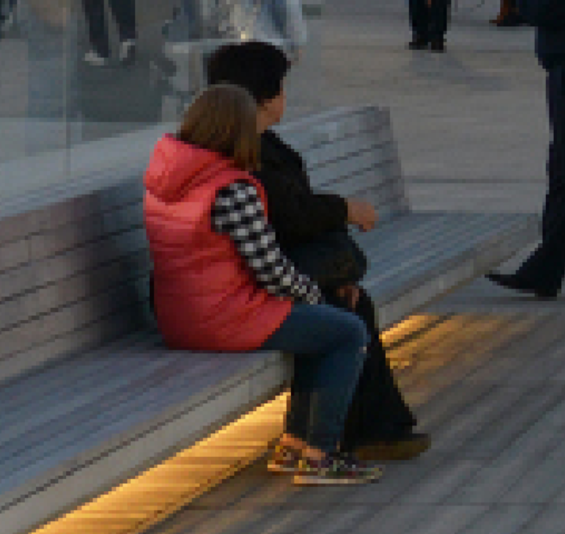 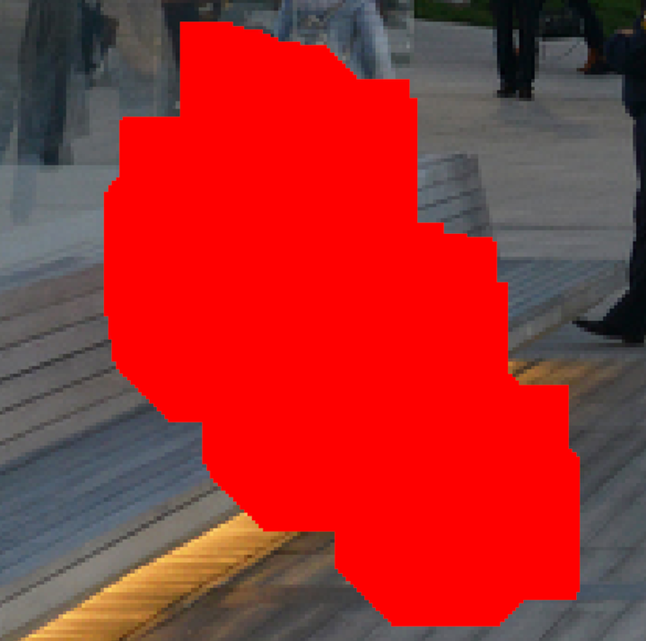 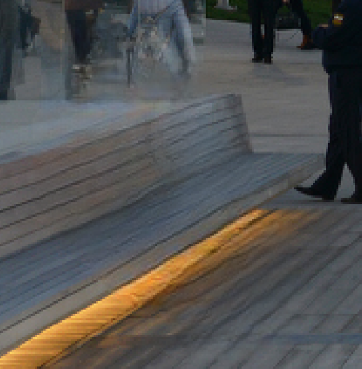
</center>

### Case 2-1

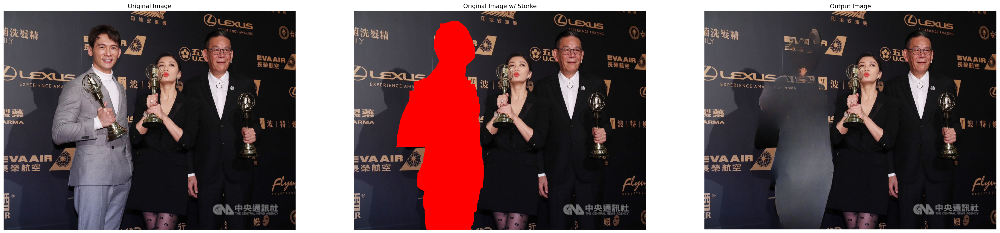

1. 人物背景過於複雜（有顏色對比高的文字和人影）
2. 部分區塊使用灰色（亮色）去做填補，推測是因為畫筆塗的邊界不夠出去（只和溫昇豪西裝邊界重合）；目前排除是因為顏色對比的緣故，因為前面 Case 1 粉紅色背心同樣與背景有明顯對比，但依然能夠將背心完全去除

<center>
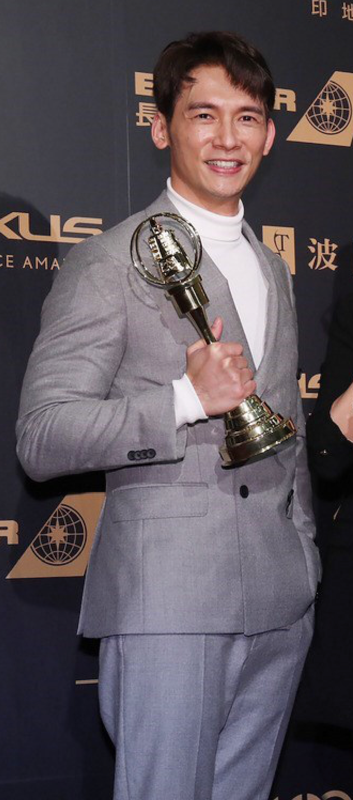 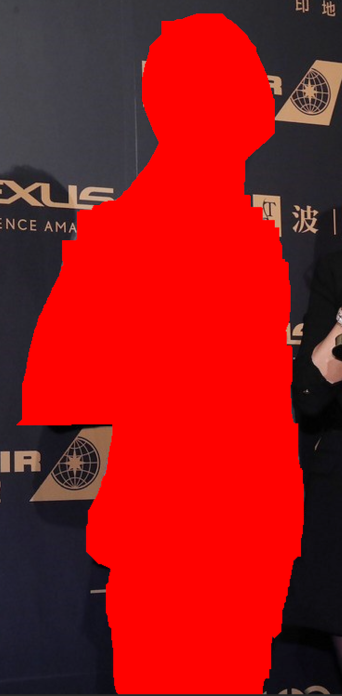 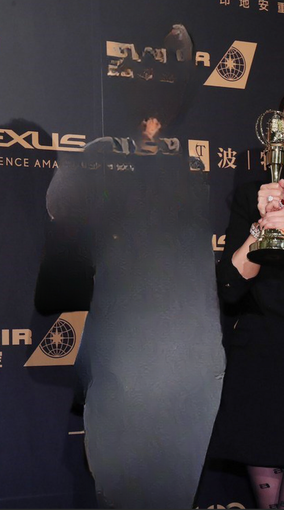
</center>

### Case 2-2

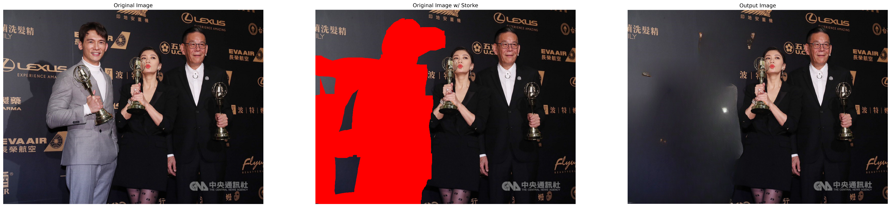


1. （上圖）這裡嘗試大面積塗改，把溫昇豪的影子和周圍背景上的有重疊的字都覆蓋，可以看到如果塗改的區域有空心部分，內部的空隙也會影響塗改區域的填補
2. （下圖）如果把塗改的區域改成實心的，效果算是不錯，除了下方（原溫昇豪右腿處）區域有些突兀的亮點，上方左邊較亮的背景和右邊較深的背景銜接挺完美的
3. （下圖）因為比畫覆蓋了整張圖的左下 1/4 區域，所以模型只能擷取左上方的顏色去填補，可以看到看到即使有一段距離，模型還是能夠將顏色從左上延伸到左下並合理銜接

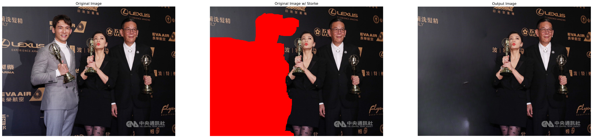

### Case 3

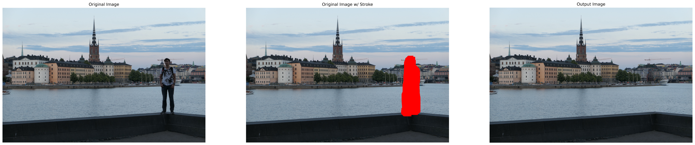

1. 後方吊臂的修補算是完整，房屋的規律有抓到，但是仍舊有陰影
2. 放大看能夠看到明顯修圖痕跡，但是整張圖片來看的話，不仔細看看不出來

<center>
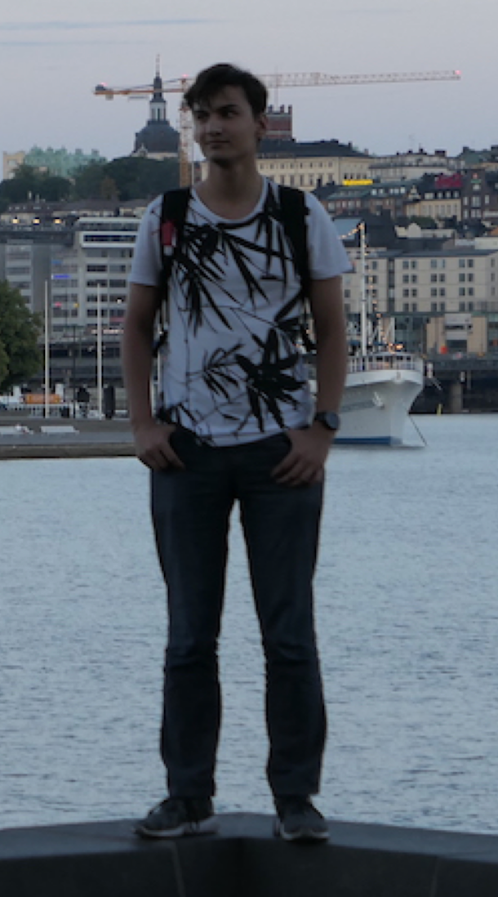 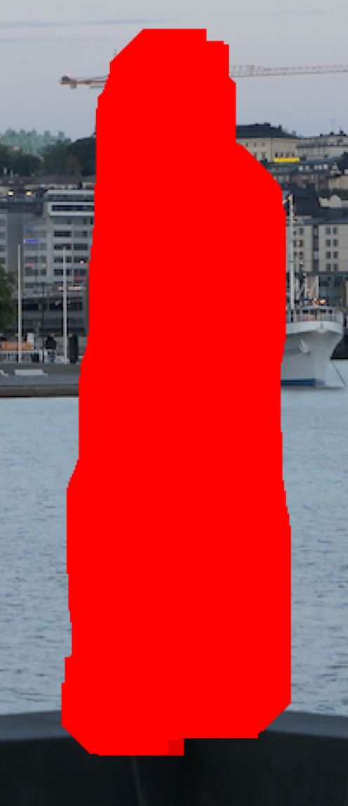 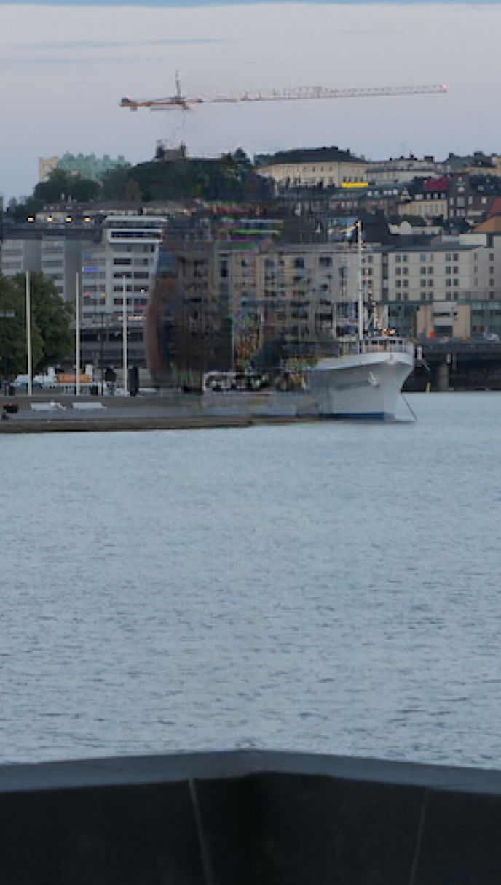
</center>

## Inference & More Info
更多細節見原本的 [README]("README.lama.md")。

Note：原本 README 上的 project directory 即 root directory，這裡的 root directory 為 `src`。

## Acknowledgments

* Segmentation code and models if form [CSAILVision](https://github.com/CSAILVision/semantic-segmentation-pytorch).
* LPIPS metric is from [richzhang](https://github.com/richzhang/PerceptualSimilarity)
* SSIM is from [Po-Hsun-Su](https://github.com/Po-Hsun-Su/pytorch-ssim)
* FID is from [mseitzer](https://github.com/mseitzer/pytorch-fid)

## Citation 
```
@article{suvorov2021resolution,
  title={Resolution-robust Large Mask Inpainting with Fourier Convolutions},
  author={Suvorov, Roman and Logacheva, Elizaveta and Mashikhin, Anton and Remizova, Anastasia and Ashukha, Arsenii and Silvestrov, Aleksei and Kong, Naejin and Goka, Harshith and Park, Kiwoong and Lempitsky, Victor},
  journal={arXiv preprint arXiv:2109.07161},
  year={2021}
}
```
